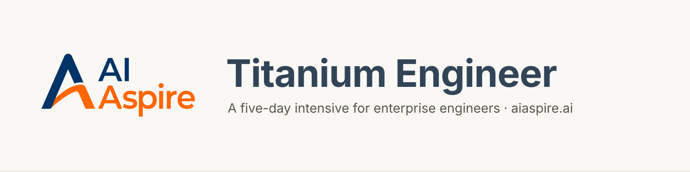

<p align="center"></p>

Titanium Engineer is AI Aspire's five-day intensive for enterprise engineers.
You arrive with a problem from your own workplace. You leave with a working
prototype, the evaluation harness that proves it works, and the habit of
measuring before you believe.

## How the week works

The course eats itself. Every notebook runs on what your group produced
earlier: the prompts you write on the first morning are the corpus you retrieve
over on the second day, the transcripts you generate are what your judge
scores, and the eval cases you write are what your agent is tested against.
Before your group has produced anything, the notebooks run on a complete
worked example called Deskmate, an internal IT helpdesk agent.

| Day | Theme | Modules | Ends with |
|---|---|---|---|
| 1 | [Simple prototyping](docs/schedule/day1.md) | 01 to 04 | five-minute pitches |
| 2 | [Retrieval](docs/schedule/day2.md) | 05 to 08 | measured RAG demos |
| 3 | [Agents in practice](docs/schedule/day3.md) | 09 to 13 | agent pitches with a capability report |
| 4 | [Advanced prototyping](docs/schedule/day4.md) | 14 to 18 | a decision per technique |
| 5 | [Demo day](docs/schedule/day5.md) | 19 to 21 | fifteen-minute demos, scored by your own harness |

## Modules

Each folder has a README, one notebook you run start to finish, and a marimo
mirror of it. Every notebook is three acts: **Learn** the idea from scratch,
**Create** it on your group's own artifacts, and **Grow** it toward production.

| # | Module | Time |
|---|---|---|
| 01 | [Dev environment](01_Dev_Environment/) | 30 min |
| 02 | [Prompt patterns](02_Prompt_Patterns/) | 30 min |
| 03 | [Agents 101](03_Agents_101/) | 35 min |
| 04 | [Vibe checks and judges](04_Vibe_Checks_and_Judges/) | 30 min |
| 05 | [RAG](05_RAG/) | 30 min |
| 06 | [Advanced retrieval](06_Advanced_Retrieval/) | 35 min |
| 07 | [Agentic retrieval](07_Agentic_Retrieval/) | 30 min |
| 08 | SDG and RAGAS | 30 min |
| 09 | [Agent evals](09_Agent_Evals/) | 35 min |
| 10 | [Agent memory](10_Agent_Memory/) | 30 min |
| 11 | Agent architecture | 35 min |
| 12 | Multi-agent | 30 min |
| 13 | [Guardrails 101](13_Guardrails_101/) | 30 min |
| 14 | [Voice agents](14_Voice_Agents/) | 40 min |
| 15 | [Prompt optimisation](15_Prompt_Optimization/) | 35 min |
| 16 | [GraphRAG](16_GraphRAG/) | 40 min |
| 17 | [Deep research](17_Deep_Research/) | 35 min |
| 18 | [Off-the-shelf guardrails](18_Off_The_Shelf_Guardrails/) | 30 min |
| 19 | Responsible AI | 25 min |
| 20 | [OWASP LLM top 10](20_OWASP_LLM_Top10/) | 35 min |
| 21 | [DeepEval](21_DeepEval/) | 35 min |

A module without a link is still being verified against a live model. It lands, with its seed artifacts, as soon as its notebook runs green.

## Setup

Follow [00_Setup](00_Setup/) once. The short version:

```bash
cp .env.template .env      # add your key and model
make setup                 # one shared environment (uv)
uv run jupyter lab         # open any module's notebook
```

Every notebook has a marimo mirror next to it. Open either one:

```bash
uv run marimo edit 05_RAG/RAG_with_LangChain.py
```

## What you need

Python 3.11 or 3.12, `uv`, `git`, and the GitHub CLI. One shared environment
covers most of the week. Four things are separate, and each README says so at
the top:

| What | Why it is separate | Command |
|---|---|---|
| `graph` group | spaCy and its model, networkx, rdflib, for the graph module | `make setup-graph` |
| `optim` group | the prompt-optimisation stack | `make setup-optim` |
| `08_SDG_RAGAS` | RAGAS pins an older LangChain line | `cd 08_SDG_RAGAS && uv sync` |
| `14_Voice_Agents` | speech-to-text and text-to-speech stack | `cd 14_Voice_Agents && uv sync` |

`make setup` keeps whichever optional groups you already installed. Plain
`uv sync` does not: it removes anything you did not name. Prefer the make
targets, and see [00_Setup](00_Setup/) for why.

## What your model needs to support

The endpoint is anything OpenAI-compatible. Two capabilities are not optional,
because the agent and evaluation modules are built on them:

- **Tool calling.** The agent modules ask the model to choose a tool.
- **Structured output.** Several notebooks parse a schema rather than prose.

A reasoning budget (`LLM_REASONING_EFFORT`) is used when the model has one and
ignored when it does not. Embeddings can come from the same endpoint or a
different one. Everything else in `.env.template` is optional and the notebooks
that use it skip cleanly when it is blank.

## Your project

`project/` is your group's directory. Fill in `CHARTER.md` on the first
morning; every notebook reads it. `make check-day D=N` at the end of each day
confirms your workspace holds what the next day needs.

## Working with an AI assistant

`AGENTS.md` is the shared source of truth for Claude Code and Codex, and
`CLAUDE.md` points at it. It asks your assistant to teach rather than to hand
you answers, and it keeps three things yours: the question answers, the
`Your turn` sections, and your group's charter and decisions. It also forbids
inventing workspace artifacts, which would leave you defending numbers nobody
measured.

## For authors

`docs/AUTHORING.md` holds the authoring rules, `docs/STYLE.md` the writing
rules, and `docs/WORKSPACE.md` the artifact contract. `make check` runs what CI
runs.
